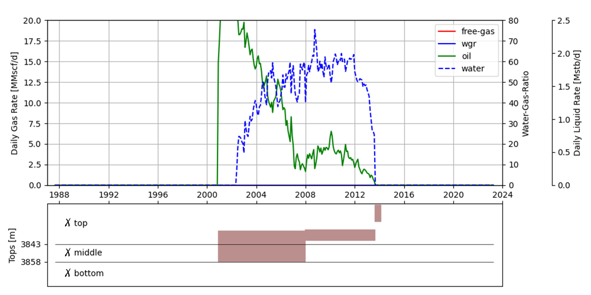
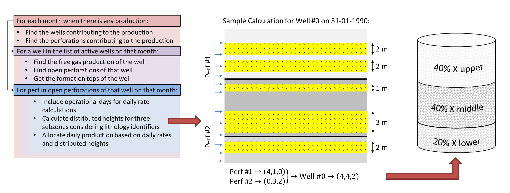
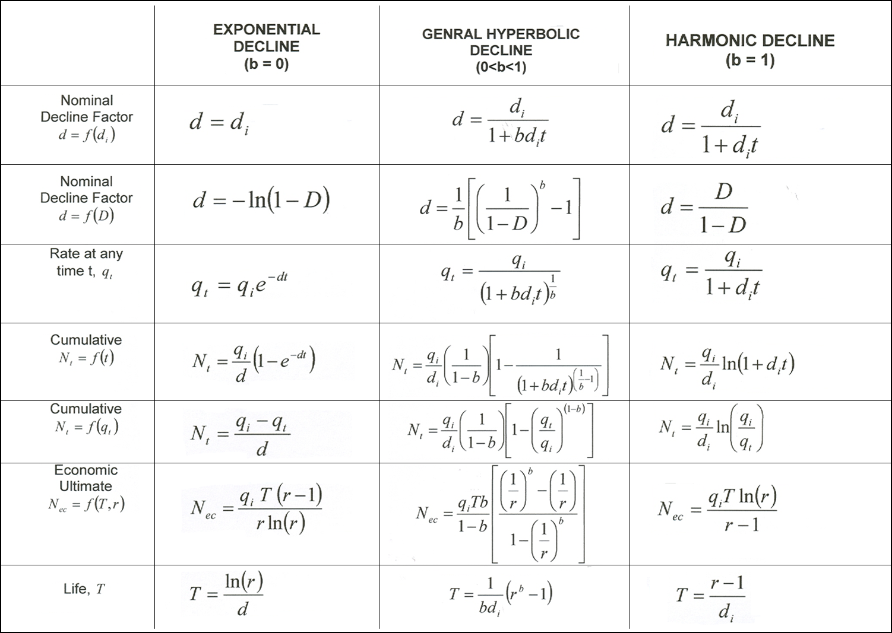

# Production Forecasting for Oil & Gas Wells

## Overview  
This repository is designed to offer comprehensive **production forecasting** solutions for oil and gas wells. It includes tools for **production data analysis**, **decline curve analysis**, and **time series analysis**, enabling users to make informed predictions about future production trends.

## Features
- **Graphical Templates** – Industry-standard visualizations for production trend analysis and interpretation.

The `prodpy.onepage` module offers ready-to-use templates for generating compact, graphical summaries of multi-dimensional production data. These visualizations combine key metrics such as oil, gas, and water rates with operational details like active perforation intervals, shut-ins, and completion events - all in a single, easy-to-read figure. Designed for quick well reviews and communication between subsurface and operations teams, the OnePage layout enhances situational awareness and supports efficient decision-making.



*Figure 1: A layout showing production rates alongside active intervals and well events.*

- **Customizable Workflow** – Modify or extend the tools to fit specific reservoir and well conditions.

The reservoir allocation function `prodpy.Allocate` provides a systematic method to distribute measured production volumes (oil, gas, and water) from commingled surface data back to individual reservoirs or layers. This is particularly useful in fields with multi-zone completions or shared infrastructure. The allocation algorithm uses layer properties such as permeability, thickness, pressure, or historical trends to estimate each zone's contribution to total production. The function supports customizable weighting schemes and can be integrated into full-field workflows for reservoir surveillance, history matching, or field development planning.



*Figure 2: A typical workflow where surface production is decomposed and allocated to contributing reservoir zones using input data from well tests and petrophysical properties.*

- **Decline Curve Analysis** – Implement common decline models (Exponential, Harmonic, Hyperbolic).

The `prodpy.decline` module provides analytical tools for fitting and forecasting production using classical decline curve models, including exponential, hyperbolic, and harmonic equations. These models are implemented with a consistent interface and allow estimation of key parameters such as decline rate, cumulative production, and well life. The module is ideal for rapid screening, reserves estimation, and performance diagnostics in conventional reservoirs.



*Table 1: The mathematical forms of the implemented decline models, highlighting their differences in rate behavior and cumulative production estimates.*

# prodpy · decline · Arps

It is a lightweight orchestrator for Arps decline-curve models — **Exponential**, **Harmonic**, and **Hyperbolic** — with a consistent, vectorized API for rates, cumulatives, linearized regression, non-linear fitting, and simple uncertainty simulation.

## ✨ Features

* **One interface, three models**: choose by `mode` (`"exponential"|"harmonic"|"hyperbolic"`) or exponent `b` (0, 1, or 0<b<1).
* **Vectorized math** over NumPy arrays.
* **Linearize → regress → invert → curve_fit** workflow with `scipy`.
* **Shifted origin (`xi`) support** for treating an arbitrary time as the new zero.
* **Readable fit results** (`FitResult`) + `reader()` helper for quick summaries.
* **Simple uncertainty sampling** via `simulate()` (t-based scaling of parameter std errors).

> Dependencies: `numpy`, `scipy` (and optionally `pytest` for tests, `matplotlib` for examples).

## 🚀 Quickstart
Example usage of the **decline curve analysis** module:  

```python
import numpy as np
from prodpy.decline import Arps

# Choose by exponent b or by mode name
m_exp = Arps(di=0.25, qi=120.0, b=0.0)               # exponential
m_har = Arps(di=0.25, qi=120.0, mode="harmonic")     # harmonic
m_hyp = Arps(di=0.25, qi=120.0, b=0.5)               # hyperbolic (b fixed)

# Time grid (consistent units with di)
t = np.linspace(0.0, 10.0, 201)

# Rates & cumulatives
q_exp = m_exp.run(t)              # rate q(t)
N_exp = m_exp.run(t, cum=True)    # cumulative N(t)

# Shifted origin (xi): analyze from day 200 as new zero
t2 = np.linspace(190.0, 220.0, 121)
q2 = m_har.run(t2, xi=200.0)      # q(t - 200) where t >= 200
```

## 🔧 Fitting workflow (linearize → regress → invert → curve_fit)

Below we synthesize data from a chosen model, add noise, and estimate parameters.

```python
import numpy as np
from prodpy.decline import Arps

# Ground truth (hyperbolic)
TRUE = dict(mode="hyperbolic", di=0.22, qi=150.0, b=0.6)

t = np.linspace(0.0, 8.0, 400)
true_model = Arps(TRUE["di"], TRUE["qi"], b=TRUE["b"])  # orchestrator
q_clean = true_model.run(t)

# Add small multiplicative noise to mimic measurements
rng = np.random.default_rng(7)
q_obs = q_clean * (1.0 + 0.01 * rng.standard_normal(q_clean.shape))

# Fit (auto-selects proper linearization based on model)
fitr = true_model.fit(t, q_obs)
print(fitr)
print(Arps.reader(fitr))

# Sample a low/high scenario (approx t-interval scaling)
lo = Arps.simulate(fitr, prc=5.0)
hi = Arps.simulate(fitr, prc=95.0)
print("(di, qi)@5%:", lo)
print("(di, qi)@95%:", hi)
```

**FitResult fields**

* `b` — model exponent (0 for exp, 1 for harmonic, 0<b<1 for hyperbolic)
* `di`, `qi` — fitted parameters
* `xi` — shift used during fit (if any)
* `n` — number of points used
* `r2` — non-linear fit R²
* `di_error`, `qi_error` — parameter standard errors from `curve_fit` covariance
* `linear` — the SciPy `linregress` result from the linearized regression step

---

## 🧠 Model selection helpers

```python
from prodpy.decline.arps import Arps

# From b → mode
print(Arps.b2mode(0.0))        # 'Exponential'
print(Arps.b2mode(1.0))        # 'Harmonic'
print(Arps.b2mode(0.45))       # 'Hyperbolic'

# From mode → b (with synonyms)
print(Arps.mode2b("exp"))     # 0.0
print(Arps.mode2b("har"))     # 1.0
print(Arps.mode2b("hyperbolic"))  # default 0.5 unless you pass explicit b at Arps(...)

# Canonical option resolver
print(Arps.option())                 # ('Exponential', 0.0)
print(Arps.option(b=0.6))            # ('Hyperbolic', 0.6)
print(Arps.option(mode="harmonic")) # ('Harmonic', 1.0)
```

> **Note**: For hyperbolic, `Arps(mode="hyperbolic", b=your_b)` is typical; if `mode` is given without `b`, the orchestrator uses a convenient default (e.g. 0.5) — pass your `b` explicitly for control.

---

## 📐 API sketch

```python
class Arps:
    # construction
    Arps(di: float, qi: float, *, b: float | None = None, mode: str | None = None)

    # basic
    .run(x, *, xi: float = 0.0, cum: bool = False) -> np.ndarray
    .fit(x, y, *, xi: float = 0.0, p0: tuple[float, float] | None = None, **kwargs) -> FitResult
    .linregress(x, y, *, xi: float = 0.0, **kwargs) -> scipy.stats.LinregressResult

    # utilities
    .reader(FitResult) -> str
    .simulate(FitResult, prc: float = 50.0) -> tuple[float, float]

    # mapping helpers
    Arps.b2mode(b: float) -> str
    Arps.mode2b(mode: str) -> float
    Arps.option(mode: str | None = None, b: float | None = None) -> tuple[str, float]
```

### Rate & cumulative conventions

* `run(x, cum=False)` returns **rate** `q(x)`.
* `run(x, cum=True)` returns **cumulative** `N(x)`.
* If you pass a shift `xi`, values where `x < xi` are masked (e.g., `NaN`) and values where `x ≥ xi` are computed at `x - xi`.


---

## ⚠️ Tips & gotchas

* **Units must be consistent**: if `di` is in 1/day, `t` is days.
* **Linearization requires q>0** for Exponential/Harmonic; Hyperbolic also expects positive rates.
* **Hyperbolic**: pass your field-calibrated `b`. Using `mode="hyperbolic"` without `b` uses a default.
* **Shifted origin (`xi`)**: fit with `xi` if you want `qi` interpreted at a later time point.
* **Noise model**: multiplicative noise keeps the transforms (log, 1/q, q^{-b}) closer to linear.

---

## 📚 References

* J.J. Arps, “Analysis of Decline Curves,” *Trans. AIME* (1945).
* Standard petroleum engineering texts on decline-curve analysis.

- **Time Series Analysis** – Utilize statistical methods and machine learning models for forecasting.

## Installation

Install in editable mode during development:

```bash
python -m pip install -U pip
python -m pip install -e .
```

or clone the repository and install the required dependencies:  

```bash
git clone https://github.com/jshiriyev/data-driven-forecasting.git  
cd data-driven-forecasting 
pip install -r requirements.txt  
```

## 🧪 Testing

Run the full suite (models + orchestrator):

```bash
python -m pip install pytest numpy scipy
pytest -q
# or parallel
pytest -n auto
```

## Dependencies  
The following libraries are required:  
- Python 3.x  
- `pandas`  
- `numpy`  
- `matplotlib`  
- `scipy`

Key checks in `tests/test_arps.py`:

* correct **mode–b mapping**
* `.run()` matches underlying model outputs (rate & cumulative)
* **shifted origin** (`xi`) behavior
* **fit accuracy** under clean/noisy data
* **linearization fidelity** (correlation in transform space)
* `reader()` text and `simulate()` monotonicity

## Contributing  
Contributions are welcome! If you find a bug or want to improve the tool, feel free to:  
1. **Fork** the repository  
2. **Create a new branch** (`feature-branch`)  
3. **Submit a pull request**  

## License  
This project is licensed under the **MIT License**. See the [LICENSE](LICENSE) file for details.
